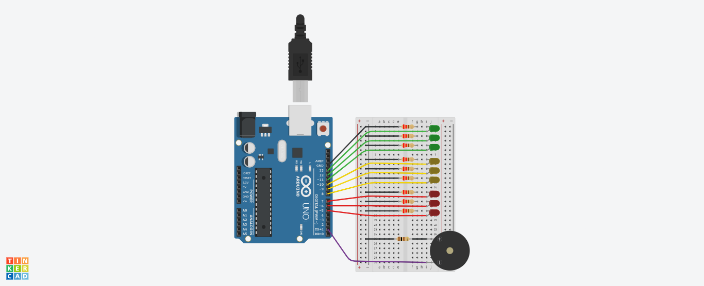

# Primer Proyecto

## Integrantes 
- Juan Cruz Mendez
- Nicolas Larrochi
- Julian Ortiz 
- Lucas Torres
- Joaquin Montiel

## Proyecto: Semaforo.

## Descripción
Este proyecto consiste en un semaforo de 9 luces led, 3 de cada color. Simula un semaforo
con señalizacion para personas no videntes. Ya que posee un piezo que suena mientras esten
encendidas las luces de color rojas y amarillas, indicando el momento en el que se puede 
cruzar.

## Función principal
Esta funcion enciende y apaga los leds cada cierto rango de tiempo, y controla la frecuencia
de sonido, y los lapsos de tiempo del piezo.

~~~ C (lenguaje en el que esta escrito)
void loop()
{
  digitalWrite(LED_VERDE1, HIGH); 
  digitalWrite(LED_VERDE2, HIGH);
  digitalWrite(LED_VERDE3, HIGH);
  noTone(PIEZO); 
  delay(45000); 

  digitalWrite(LED_VERDE1, LOW); 
  digitalWrite(LED_VERDE2, LOW);
  digitalWrite(LED_VERDE3, LOW);
  digitalWrite(LED_AMARILLO1, HIGH); 
  digitalWrite(LED_AMARILLO2, HIGH);
  digitalWrite(LED_AMARILLO3, HIGH);
  for (int i = 0; i < 5; i++) { 
    tone(PIEZO, 440); 
    delay(400);
    noTone(PIEZO);
    delay(1600); 
  }

  digitalWrite(LED_AMARILLO1, LOW); 
  digitalWrite(LED_AMARILLO2, LOW);
  digitalWrite(LED_AMARILLO3, LOW);
  digitalWrite(LED_ROJO1, HIGH); 
  digitalWrite(LED_ROJO2, HIGH);
  digitalWrite(LED_ROJO3, HIGH);
  for (int i = 0; i < 30; i++) { 
    tone(PIEZO, 329); 
    delay(400);
    noTone(PIEZO);
    delay(600);
  }
}
~~~

## :robot: Link al proyecto
- [ProyectoSemaforo](https://www.tinkercad.com/things/bGMXosfeWJt-1g-dojo-uno-larrochi-nicolas-gaston/editel?sharecode=263m2zKwATqCoa8Coq27JEYd2aZZqxgr7D1R8_IoB30)
